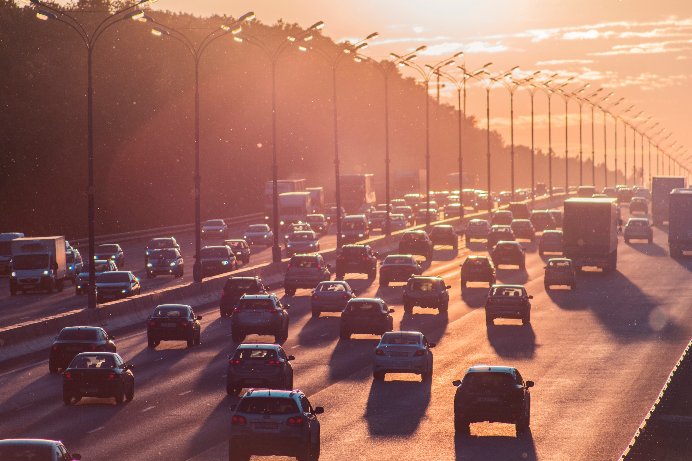
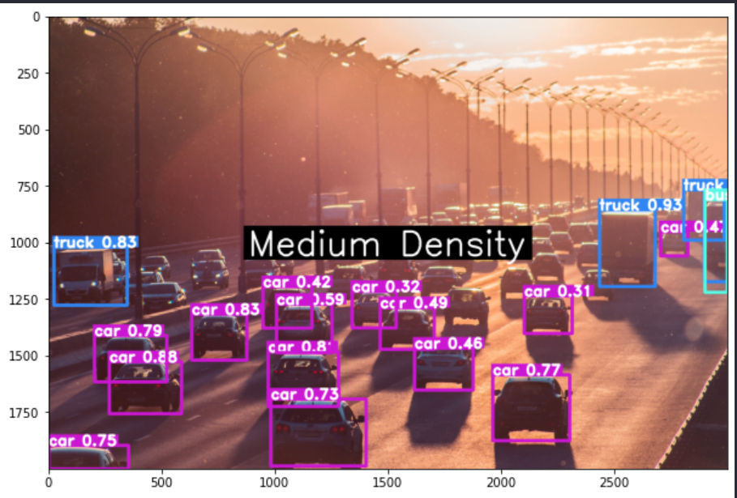

# yolo-v4-tf.keras

A simple tf.keras implementation of YOLO v4




## TODO

- [x] Cosine annealing scheduler
- [x] mAP
- [ ] Mosaic augmentation
- [ ] DropBlock
- [ ] Self-adversarial training (SAT)
- [ ] Label smoothing
- [x] Mish
- [x] IoU, GIoU, CIoU loss
- [x] multi-GPU training

## Quick Start

1. Download official YOLO v4 pre-trained weights from [github/AlexeyAB/darknet](https://github.com/AlexeyAB/darknet#how-to-evaluate-ap-of-yolov4-on-the-ms-coco-evaluation-server)
2. Initialize YOLO model and load weights
3. Run prediction

   Example: [Inference.ipynb](notebook/Inference.ipynb):

```python
from models import Yolov4
model = Yolov4(weight_path='yolov4.weights',
               class_name_path='class_names/coco_classes.txt')
model.predict('input.jpg')
```

## Training

1. Generate your annotation files (.XML) in VOC format for each images

   _HINT:_ An easily used annotation tool: [labelImg](https://github.com/tzutalin/labelImg)

   Example: A 2 object xml file

   ```xml
   <annotation>
       <folder>train_img2</folder>
       <filename>yui.jpg</filename>
       <path>/Users/taipingeric/dataset/train_img2/yui.jpg</path>
       <source>
           <database>Unknown</database>
       </source>
       <size>
           <width>465</width>
           <height>597</height>
           <depth>3</depth>
       </size>
       <segmented>0</segmented>
       <object>
           <name>person</name>
           <pose>Unspecified</pose>
           <truncated>1</truncated>
           <difficult>0</difficult>
           <bndbox>
               <xmin>43</xmin>
               <ymin>41</ymin>
               <xmax>430</xmax>
               <ymax>597</ymax>
           </bndbox>
       </object>
       <object>
           <name>person</name>
           <pose>Unspecified</pose>
           <truncated>1</truncated>
           <difficult>0</difficult>
           <bndbox>
               <xmin>60</xmin>
               <ymin>70</ymin>
               <xmax>20</xmax>
               <ymax>207</ymax>
           </bndbox>
       </object>
   </annotation>

   ```

2. Convert all XML files to a single .txt file:

   Row format: `img_path BOX0 BOX1 BOX2 ...`

   BOX format: `xmin,ymin,xmax,ymax,class_id`

   Example: [xml_to_txt.py](xml_to_txt.py)

   ```
   img1.jpg 50,60,70,80,0 70,90,100,180,2
   img2.jpg 10,60,70,80,0
   ...
   ```

3. Generate class name file, # of lines == # of classes

   Example: [coco_classes.txt](class_names/coco_classes.txt)

   ```
   person
   bicycle
   car
   motorbike
   aeroplane
   bus
   ...
   ```

4. Train with the code below

   Example: [train.ipynb](notebook/train.ipynb)

```python

from utils import DataGenerator, read_annotation_lines
from models import Yolov4

train_lines, val_lines = read_annotation_lines('../dataset/txt/anno-test.txt',
                                               test_size=0.1)
FOLDER_PATH = '../dataset/img'
class_name_path = '../class_names/bccd_classes.txt'
data_gen_train = DataGenerator(train_lines,
                               class_name_path,
                               FOLDER_PATH)
data_gen_val = DataGenerator(val_lines,
                             class_name_path,
                             FOLDER_PATH)

model = Yolov4(weight_path=None,
               class_name_path=class_name_path)

model.fit(data_gen_train,
          initial_epoch=0,
          epochs=10000,
          val_data_gen=data_gen_val,
          callbacks=[])

```

## Acknowledgements

- [qqwweee/keras-yolo3](https://github.com/qqwweee/keras-yolo3)
- [AlexeyAB/darknet](https://github.com/AlexeyAB/darknet)
- [hunglc007/tensorflow-yolov4-tflite](https://github.com/hunglc007/tensorflow-yolov4-tflite)
- [Cartucho/mAP](https://github.com/Cartucho/mAP)
- [miemie2013/Keras-YOLOv4](https://github.com/miemie2013/Keras-YOLOv4)
- [david8862/keras-YOLOv3-model-set](https://github.com/david8862/keras-YOLOv3-model-set)
- [Ma-Dan/keras-yolo4](https://github.com/Ma-Dan/keras-yolo4)
